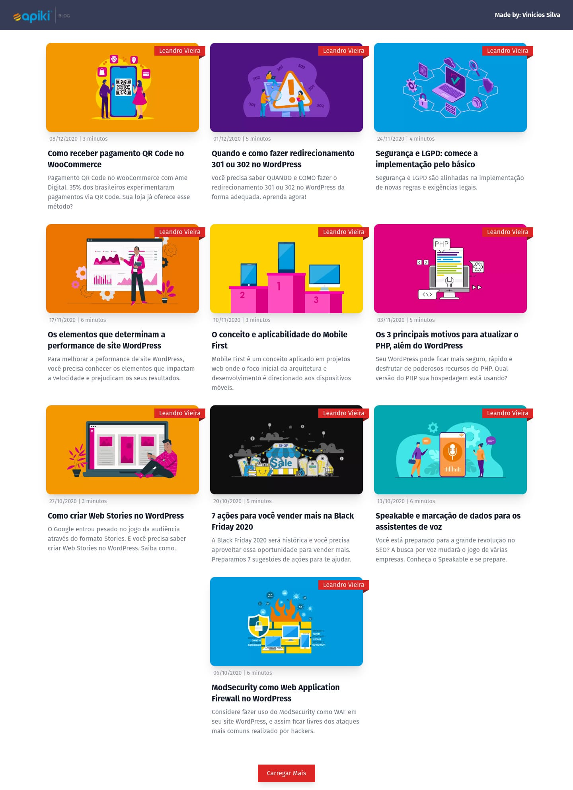

<p align="center">	
   <a href="https://www.linkedin.com/in/vinicios-alves/">
      
   </a>
  
  <a href="mailto:viniciossilvadev@gmail.com">
   
  </a>
</p>

<p align="center">
  Challenge Apiki Blog API.
</p>

<div align="center">
  <sub> Made with 💖 by
    <a href="https://github.com/VinewZ">Vinicios Silva.
  </sub>
</div>

# 📌 Contents

* [Screenshots](#camera-screenshot) 
* [Technologies](#rocket-technologies) 
* [How to Run](#computer-how-to-run)

# :camera: Screenshots
<div align="center">
   
</div>

# :rocket: Technologies
This project was made using the follow technologies:

* [Typescript](https://www.typescriptlang.org/)      
* [React](https://reactjs.org/)      
* [Tailwind](https://tailwindcss.com/)
* [APIKI Api](https://blog.apiki.com/wp-json/wp/v2/posts?_embed)

# :computer: How to run

```bash
# Clone Repository
$ git clone https://github.com/VinewZ/Apiki-Front-Challenge.git
```

```bash
# Install Dependencies
$ yarn install

# Create a .env.local file at the root of the repository and create the environment variable
VITE_API_URL = https://blog.apiki.com/wp-json/wp/v2/posts?_embed

# Run Aplication
$ yarn run dev
```
Go to http://localhost:3000/ to see the result.

Made with 💖 by [Vinicios Silva](https://www.linkedin.com/in/vinicios-alves/). 

Thank you! 🌠