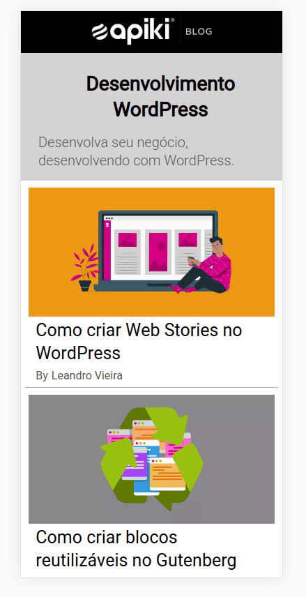

# Welcome to challenge Front-end Developer - Apiki

## How to use this app
1. Clone the project
2. Install the dependencies 
* run npm install from the root directory
3. Start the app
* Run from the root "npm start"

## What it is about ?
Objective is to build a version of the Apiki blog just for Devs, this to be a headless solution with the following pages:

### Homepage: 
Will list the latest blog posts with the Development category;
### Internal: 
It will display the content of the post;

## Gif of the App:

## Link to the App

[Link](https://mathieubouhelier.github.io/testcss/#/)

## Diagram of the code structure

## Technologies
* React
* Redux
* Axios
* Helmet
* CSS Mobile first

## roadmap

- [x] Create the React-Router structure
- [x] Create the Reducer structure
- [x] Fetching the Api with Axios
- [x] Create the Home page
- [x] Create the Post page
- [x] CSS Mobile Home
- [x] CSS desktop Home
- [x] CSS Mobile Post
- [x] CSS desktop Post
- [x] SEO implementation
- [x] Documentation

Could be nice to do to improve the App

- [ ] Add a search bar at the Home page
- [ ] CSS search bar mobile
- [ ] CSS search bar desktop
- [ ] Use the tags for SEO
- [ ] Implement Tests

